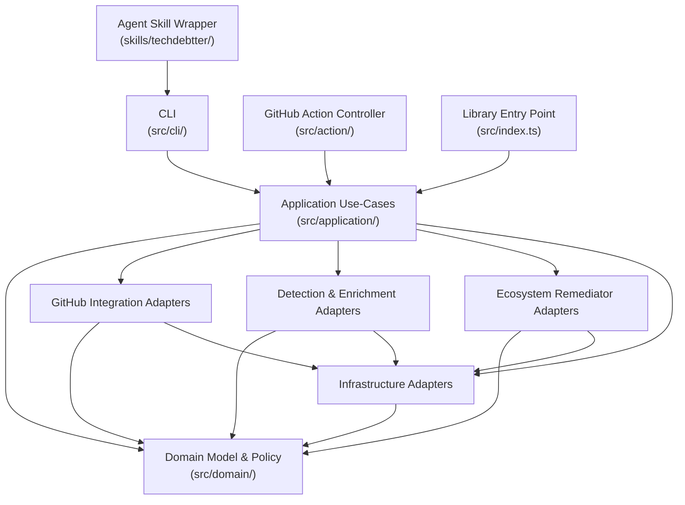
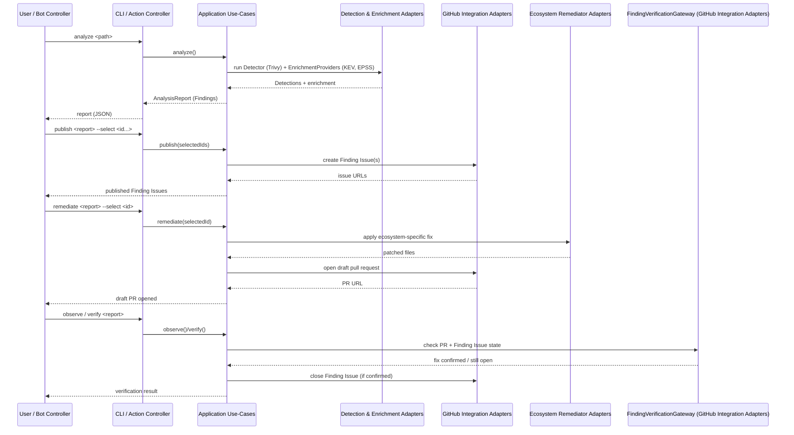

## Architecture Analysis

### System Overview

TechDebtter is a single npm package (no monorepo/workspaces, per SPEC C12) that ships three entry points sharing one domain core: a CLI (`src/cli/`), a GitHub Action (`src/action/`), and a library entry point (`src/index.ts`). All three drive the same application use-cases (`src/application/`) against a hexagonal domain core (`src/domain/`) through seven external ports implemented by a set of adapters (`src/adapters/`). The delivered slice is deterministic and local: one vulnerability detector (Trivy) enriched with CISA KEV and FIRST EPSS feeds, publishing to GitHub Issues, and five ecosystem-specific code-changing remediators, all gated by explicit human/policy selection.

### Architectural Style

**Hexagonal (Ports & Adapters), single deployable package, multi-entry-point.** Evidence:
- `src/domain/ports.ts` defines 7 external port interfaces (`RepositorySource`, `Detector`, `EnrichmentProvider`, `GitHubGateway`, `FindingVerificationGateway`, `Cache`, `Clock`) that the domain and application layers depend on only as abstractions.
- `src/adapters/` implements each port against a concrete technology (Git CLI, Trivy CLI, Octokit, filesystem cache, KEV/EPSS HTTP feeds).
- Three separate entry points (`src/cli/main.ts`, `src/action/main.ts`, `src/index.ts`) each wire concrete adapters into the same application use-cases (`src/application/`), rather than the application layer depending on any one entry point.
- Not microservices or serverless-native: it is a single bundled package (three `tsup` build targets — library, CLI, Action — from one codebase) invoked synchronously per run; there is no independent runtime service boundary between components.

### Component Relationships

Text fallback: Agent Skill Wrapper calls the CLI. CLI, GitHub Action Controller, and Library Entry Point each call Application Use-Cases. Application Use-Cases calls Domain Model & Policy plus the three adapter groups (GitHub Integration, Detection & Enrichment, Ecosystem Remediator) and Infrastructure Adapters. All adapter groups depend on Domain Model & Policy (for port contracts) and on Infrastructure Adapters (for process execution / fetch / cache primitives).

### Data Flow

1. **Discover** (Action only): the controller resolves which repositories/policy apply.
2. **Analyze**: `RepositorySource` (local Git) supplies repo state; the single registered `Detector` (`TrivyVulnerabilityDetector`) runs Trivy as a subprocess and returns raw `Detection`s; `EnrichmentProvider`s (`CisaKevProvider`, `FirstEpssProvider`) enrich them with exploited/exploit-likelihood data; `src/domain/triage.ts` and `criticality.ts` score and de-duplicate (via `fingerprint.ts`) the results into `Finding`s validated against `schemas/analysis-report.schema.json`.
3. **Publish**: a human or policy selects specific Finding IDs; `GitHubGateway` creates one GitHub Issue per selected Finding ("Finding Issue").
4. **Remediate**: a human or policy selects a published Finding to fix; the matching Ecosystem Remediator Adapter (chosen by the Finding's package ecosystem) edits the relevant manifest/lockfile and `GitHubGateway`/`remediation-github.ts` opens a draft pull request, bounded by a configured draft-PR budget.
5. **Observe / Verify**: `FindingVerificationGateway` polls pull-request and Finding-Issue state; on confirmed fix it closes the Finding Issue.

Cross-cutting: `Cache` (filesystem-backed) memoizes expensive lookups (e.g. enrichment feed responses); `Clock` supplies testable time for freshness/expiry logic.

### Interaction Diagrams

How the four business transactions — analyze, publish, remediate, verify — are implemented across components, in the order the GitHub Action Controller (or an equivalent manual CLI sequence) drives them:

Text fallback: the user or bot controller invokes `analyze`, which runs the Detection & Enrichment Adapters and returns a report of Findings. The user selects Findings to `publish`, which the GitHub Integration Adapters turn into Finding Issues. The user selects a published Finding to `remediate`, which an Ecosystem Remediator Adapter fixes and the GitHub Integration Adapters turn into a draft pull request. Finally `observe`/`verify` uses the `FindingVerificationGateway` (part of the GitHub Integration Adapters) to poll PR/issue state and close the Finding Issue once the fix is confirmed.

### Key Design Decisions

- **Ports & Adapters over direct SDK calls**: every external system (Git, Trivy, GitHub, KEV, EPSS, filesystem, clock) is behind a domain-owned port interface, keeping `src/application/` and `src/domain/` free of I/O and making the CLI, Action, and library entry points thin wiring layers over the same core.
- **Explicit human/policy selection gate between analyze → publish and publish → remediate**: no unattended detection-to-remediation autopilot; `unattended-select.ts` exists but still operates against policy-defined rules, not silent auto-remediation.
- **Single detector today, extensible registration**: `productDefaults.detectors` in `src/domain/policy.ts` and the CLI's `capabilities --json` output make the currently-registered detector set introspectable, so adding a second `Detector` implementation is additive, not a redesign — but as of this scan only `trivy-vulnerability` is registered (see `code-quality-assessment.md`).
- **Bundled, dependency-free Action**: `tsup.config.ts`'s `noExternal: [/.*/]` for the Action build means `action/main.js` ships with all dependencies inlined, so the GitHub Action runs with no separate `npm install` step.
- **Independent dependency wiring in CLI vs. Action**: `src/cli/bootstrap.ts` and `src/action/main.ts`'s `createAnalyzeDependencies` each wire the same adapter set independently rather than sharing a factory — a contained, low-risk duplication (see `code-quality-assessment.md`).

### Improvement Opportunities

- Extract a shared dependency-wiring factory used by both `src/cli/bootstrap.ts` and `src/action/main.ts` to remove the duplication noted above.
- Correct README.md's top-of-file detection-scope description (8 categories) to match the single-detector reality that SPEC.md, `docs/architecture.md`, and the code already agree on — see `code-quality-assessment.md` for the full finding.
- Add `FindingVerificationGateway` to SPEC I9's and `docs/architecture.md`'s port lists so the documented port count (currently "six") matches the seven ports actually defined in `src/domain/ports.ts`.
- Resolve whether the SPEC C10 / `docs/architecture.md`-described scheduled, non-blocking live smoke-test workflow exists outside this repository or was never implemented; `.github/workflows/` currently contains only the push/PR-triggered `ci.yml`.
- Document the existing `observe`/`verify` CLI subcommands in README's user-facing "Usage" section (they currently surface only implicitly via the "Bot controller" phases list).
