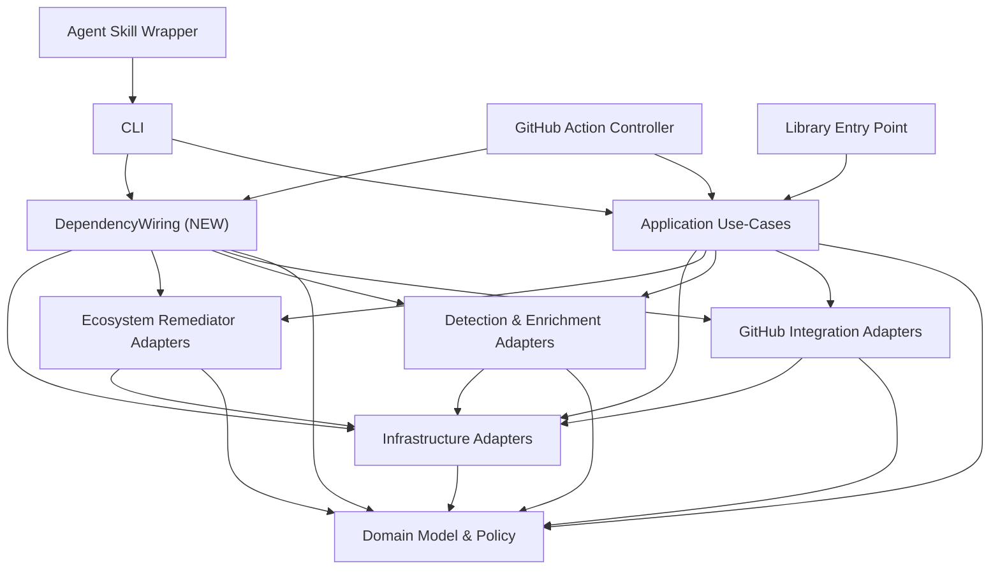

# Domain Design — Component Catalogue

## Sources

- [memory] `codekb/techdebtter/component-inventory.md` — eight existing brownfield components, authoritative names
- [memory] `codekb/techdebtter/code-structure.md` — "Wiring/composition" file classification (`src/cli/bootstrap.ts`, `src/action/main.ts`'s `createAnalyzeDependencies`)
- [memory] `codekb/techdebtter/architecture.md` — Key Design Decisions, Improvement Opportunities (duplication finding)
- `requirements.md` FR4.1 — the requirement this component realizes
- [Q1]-[Q3] `domain-design-questions.md` — this stage's answered questions

Only one component is new this pass (`DependencyWiring`, Q1). The eight
existing components below are carried forward unchanged from
`component-inventory.md` for completeness of the catalogue's dependency
graph — none of their responsibilities, boundaries, or entities change.

## Component Catalogue

```yaml
components:
  - name: DependencyWiring
    summary: Constructs and wires the concrete adapter set (GitHub Integration, Detection & Enrichment, Ecosystem Remediator, Infrastructure) into Application Use-Cases, shared by both entry points that need it.
    behaviour: >
      Pure construction logic: given no runtime state beyond process
      environment/config, returns a fully-wired set of adapter instances
      ready to inject into Application Use-Cases. No business rules, no
      validation, no owned data — mirrors what src/cli/bootstrap.ts and
      src/action/main.ts's createAnalyzeDependencies each already do
      independently today.
    responsibilities:
      - Construct concrete adapter instances (GitHub Integration Adapters, Detection & Enrichment Adapters, Ecosystem Remediator Adapters, Infrastructure Adapters)
      - Inject the constructed adapters into Application Use-Cases entry points
    depends_on:
      - component: Domain Model & Policy
        interaction: constructs adapters against the port interfaces Domain Model & Policy defines
        style: sync
      - component: GitHub Integration Adapters
        interaction: instantiates concrete adapter implementations
        style: sync
      - component: Detection & Enrichment Adapters
        interaction: instantiates concrete adapter implementations
        style: sync
      - component: Ecosystem Remediator Adapters
        interaction: instantiates concrete adapter implementations
        style: sync
      - component: Infrastructure Adapters
        interaction: instantiates concrete adapter implementations
        style: sync
    dependents:
      - component: CLI
        interaction: obtains a wired adapter set at bootstrap instead of wiring its own
      - component: GitHub Action Controller
        interaction: obtains a wired adapter set at bootstrap instead of wiring its own
    external_dependencies: []
    entities: []

  - name: CLI
    summary: Commander-based command-line entry point exposing 6 subcommands.
    behaviour: >
      Parses CLI arguments and dispatches to Application Use-Cases; obtains
      its adapter set from DependencyWiring instead of wiring its own
      (changed by FR4.1 — was previously self-contained in bootstrap.ts).
    responsibilities:
      - Command-line argument parsing and dispatch
      - Output rendering, exit-code contract
    depends_on:
      - component: Application Use-Cases
        interaction: invokes business transactions
        style: sync
      - component: DependencyWiring
        interaction: obtains wired adapter set at bootstrap
        style: sync
    dependents: []
    external_dependencies: []
    entities: []

  - name: GitHub Action Controller
    summary: GitHub Action entry point exposing 6 phases via a switch on inputs.phase.
    behaviour: >
      Dispatches to Application Use-Cases per the selected phase; obtains
      its adapter set from DependencyWiring instead of wiring its own via
      createAnalyzeDependencies (changed by FR4.1).
    responsibilities:
      - Phase dispatch (discover, analyze, publish, remediate, observe, verify)
    depends_on:
      - component: Application Use-Cases
        interaction: invokes business transactions
        style: sync
      - component: DependencyWiring
        interaction: obtains wired adapter set at bootstrap
        style: sync
    dependents: []
    external_dependencies: []
    entities: []

  - name: Library Entry Point
    summary: Re-exports domain types and promise-returning functions for programmatic consumers.
    behaviour: >
      Unchanged this pass — does not wire adapters itself; callers supply their own.
    responsibilities:
      - Programmatic API surface
    depends_on:
      - component: Application Use-Cases
        interaction: re-exports use-case functions
        style: sync
    dependents: []
    external_dependencies: []
    entities: []

  - name: Domain Model & Policy
    summary: Core domain types, 7 port interfaces, scoring rules, policy loading/validation.
    behaviour: >
      Unchanged this pass.
    responsibilities:
      - Domain types (Finding, Detection, etc.)
      - Port interface definitions (RepositorySource, Detector, EnrichmentProvider, GitHubGateway, FindingVerificationGateway, Cache, Clock)
      - Criticality/triage scoring, fingerprinting, policy loading/validation
    depends_on: []
    dependents:
      - component: DependencyWiring
        interaction: constructs adapters against these port interfaces
    external_dependencies: []
    entities:
      - name: Finding
        identifier: id
        attributes: [ecosystem, packageName, severity, criticality, status]
      - name: Detection
        identifier: id
        attributes: [detectorId, packageName, vulnerabilityId]

  - name: Application Use-Cases
    summary: Orchestrates the business transactions (analyze, publish, remediate, verify/observe).
    behaviour: >
      Unchanged this pass — receives wired adapters as constructor/factory
      parameters, now supplied by DependencyWiring instead of by each
      entry point independently.
    responsibilities:
      - analyze, publish, remediate, verify, observe transaction orchestration
      - Report validation/hashing against schemas
    depends_on:
      - component: Domain Model & Policy
        interaction: uses domain types and policy rules
        style: sync
      - component: GitHub Integration Adapters
        interaction: publishes issues, opens PRs, polls state
        style: sync
      - component: Detection & Enrichment Adapters
        interaction: runs detection and enrichment
        style: sync
      - component: Ecosystem Remediator Adapters
        interaction: applies ecosystem-specific fixes
        style: sync
      - component: Infrastructure Adapters
        interaction: caching, process execution
        style: sync
    dependents:
      - component: CLI
        interaction: invoked by CLI commands
      - component: GitHub Action Controller
        interaction: invoked by Action phases
      - component: Library Entry Point
        interaction: re-exported for programmatic use
    external_dependencies: []
    entities: []

  - name: GitHub Integration Adapters
    summary: Implements GitHubGateway and FindingVerificationGateway ports.
    behaviour: >
      Unchanged this pass.
    responsibilities:
      - GitHub Issues/PR operations via Octokit
      - GitHub App authentication
      - Local Git operations
    depends_on:
      - component: Domain Model & Policy
        interaction: implements port interfaces
        style: sync
      - component: Infrastructure Adapters
        interaction: process execution for Git operations
        style: sync
    dependents:
      - component: Application Use-Cases
        interaction: invoked for publish/remediate/verify transactions
      - component: DependencyWiring
        interaction: instantiated as part of wiring
    external_dependencies:
      - name: GitHub REST API
        kind: third-party-api
        purpose: Issues, pull requests, GitHub App auth
    entities: []

  - name: Detection & Enrichment Adapters
    summary: Implements Detector and EnrichmentProvider ports.
    behaviour: >
      Unchanged this pass.
    responsibilities:
      - TrivyVulnerabilityDetector (sole registered detector)
      - CisaKevProvider, FirstEpssProvider enrichment
    depends_on:
      - component: Domain Model & Policy
        interaction: implements port interfaces
        style: sync
      - component: Infrastructure Adapters
        interaction: process execution for Trivy, fetch for KEV/EPSS
        style: sync
    dependents:
      - component: Application Use-Cases
        interaction: invoked for analyze transaction
      - component: DependencyWiring
        interaction: instantiated as part of wiring
    external_dependencies:
      - name: Trivy CLI
        kind: third-party-api
        purpose: vulnerability scanning
      - name: CISA KEV feed
        kind: third-party-api
        purpose: exploited-in-the-wild enrichment
      - name: FIRST EPSS feed
        kind: third-party-api
        purpose: exploit-likelihood enrichment
    entities: []

  - name: Ecosystem Remediator Adapters
    summary: Five code-changing remediators (npm, Python, Docker, Ruby, Terraform).
    behaviour: >
      Unchanged this pass.
    responsibilities:
      - Ecosystem-specific manifest/lockfile remediation
    depends_on:
      - component: Domain Model & Policy
        interaction: implements domain remediation rules
        style: sync
      - component: Infrastructure Adapters
        interaction: process execution, filesystem
        style: sync
    dependents:
      - component: Application Use-Cases
        interaction: invoked for remediate transaction
      - component: DependencyWiring
        interaction: instantiated as part of wiring
    external_dependencies: []
    entities: []

  - name: Infrastructure Adapters
    summary: Implements Cache and Clock ports plus shared low-level primitives.
    behaviour: >
      Unchanged this pass.
    responsibilities:
      - Filesystem-backed cache
      - fetch wrapper, execa-based subprocess runner
    depends_on:
      - component: Domain Model & Policy
        interaction: implements port interfaces
        style: sync
    dependents:
      - component: Application Use-Cases
        interaction: caching, process execution
      - component: GitHub Integration Adapters
        interaction: process execution for Git
      - component: Detection & Enrichment Adapters
        interaction: process execution for Trivy, fetch for KEV/EPSS
      - component: Ecosystem Remediator Adapters
        interaction: process execution, filesystem
      - component: DependencyWiring
        interaction: instantiated as part of wiring
    external_dependencies: []
    entities: []

  - name: Agent Skill Wrapper
    summary: Thin conversational wrapper that delegates to the CLI.
    behaviour: >
      Unchanged this pass.
    responsibilities:
      - Conversational delegation to CLI
    depends_on:
      - component: CLI
        interaction: delegates all work to CLI commands
        style: sync
    dependents: []
    external_dependencies: []
    entities: []
```

## Component Diagram



Text fallback: Agent Skill Wrapper calls CLI. CLI and GitHub Action
Controller each call Application Use-Cases and the new DependencyWiring
component (replacing their previous independent adapter construction).
Library Entry Point calls Application Use-Cases directly (unchanged;
programmatic callers supply their own adapters). DependencyWiring
constructs instances of GitHub Integration Adapters, Detection &
Enrichment Adapters, Ecosystem Remediator Adapters, and Infrastructure
Adapters, all implemented against Domain Model & Policy's port
interfaces. Application Use-Cases calls the same four adapter groups plus
Domain Model & Policy directly at runtime, unchanged.

## Component Summary

| Component | Purpose | Depends On | Dependents | Entities Owned |
|---|---|---|---|---|
| DependencyWiring | Construct + wire adapter set | Domain Model & Policy, GitHub Integration Adapters, Detection & Enrichment Adapters, Ecosystem Remediator Adapters, Infrastructure Adapters | CLI, GitHub Action Controller | none |
| CLI | Command-line entry point | Application Use-Cases, DependencyWiring | none | none |
| GitHub Action Controller | GitHub Action entry point | Application Use-Cases, DependencyWiring | none | none |
| Library Entry Point | Programmatic API | Application Use-Cases | none | none |
| Domain Model & Policy | Domain types, ports, policy | none | DependencyWiring, Application Use-Cases, GitHub/Detection/Remediator/Infrastructure Adapters | Finding, Detection |
| Application Use-Cases | Business transaction orchestration | Domain Model & Policy, 4 adapter groups | CLI, GitHub Action Controller, Library Entry Point | none |
| GitHub Integration Adapters | GitHubGateway/FindingVerificationGateway impl | Domain Model & Policy, Infrastructure Adapters | Application Use-Cases, DependencyWiring | none |
| Detection & Enrichment Adapters | Detector/EnrichmentProvider impl | Domain Model & Policy, Infrastructure Adapters | Application Use-Cases, DependencyWiring | none |
| Ecosystem Remediator Adapters | 5 ecosystem remediators | Domain Model & Policy, Infrastructure Adapters | Application Use-Cases, DependencyWiring | none |
| Infrastructure Adapters | Cache, Clock, shared primitives | Domain Model & Policy | Application Use-Cases, GitHub/Detection/Remediator Adapters, DependencyWiring | none |
| Agent Skill Wrapper | Conversational CLI delegation | CLI | none | none |

## Entity Ownership

| Entity | Owning Component | Identifier | Attributes | References |
|---|---|---|---|---|
| Finding | Domain Model & Policy | id | ecosystem, packageName, severity, criticality, status | — |
| Detection | Domain Model & Policy | id | detectorId, packageName, vulnerabilityId | — |

## External Dependencies

| Component | Dependency | Kind | Purpose |
|---|---|---|---|
| GitHub Integration Adapters | GitHub REST API | third-party-api | Issues, PRs, GitHub App auth |
| Detection & Enrichment Adapters | Trivy CLI | third-party-api | vulnerability scanning |
| Detection & Enrichment Adapters | CISA KEV feed | third-party-api | exploited-in-the-wild enrichment |
| Detection & Enrichment Adapters | FIRST EPSS feed | third-party-api | exploit-likelihood enrichment |

## Rationale

| Component | Why a distinct building block |
|---|---|
| DependencyWiring | Distinct concern from both CLI (command parsing) and GitHub Action Controller (phase dispatch); today's duplication exists precisely because this concern wasn't given its own home. Extracting it removes the duplication `architecture.md`/`code-quality-assessment.md` flag without changing either entry point's public contract. |
| All other components | Carried forward unchanged from `component-inventory.md`; no boundary changes this pass. |

No component-boundary trade-off options are presented here: Q1's three
options were resolved directly by the human at the questions stage
(favoring a new component over stretching an existing layer's boundary
rules), so there is a single chosen decomposition with its rejected
alternatives recorded in `decisions.md` ADR-001 rather than restated here.

## Review

**Verdict:** NOT-READY
**Reviewer:** aidlc-architecture-reviewer-agent
**Date:** 2026-09-10T02:00:55Z
**Iteration:** 1

### Findings

| ID | Severity | Location | Finding | Required action | Status |
|---|---|---|---|---|---|
| R-01 | Major | components.md > `components:` YAML > `CLI.dependents` (line 72) | `CLI.dependents` is `[]`, but `Agent Skill Wrapper.depends_on` (lines 274-276) names `CLI` as a dependency. `depends_on`/`dependents` must be symmetric per this stage's well-formedness rules, and this pair is not — a developer or tool reading the YAML catalogue in isolation (not the prose diagram) would conclude nothing depends on `CLI`. | Add `Agent Skill Wrapper` to `CLI.dependents` in the YAML block. | New |
| R-02 | Major | components.md > `components:` YAML > `Domain Model & Policy.dependents` (lines 118-120) | `Domain Model & Policy.dependents` lists only `DependencyWiring`, but `Application Use-Cases`, `GitHub Integration Adapters`, `Detection & Enrichment Adapters`, `Ecosystem Remediator Adapters`, and `Infrastructure Adapters` all declare `Domain Model & Policy` in their own `depends_on` (lines 140-142, 173-176, 198-201, 228-231, 250-253). The Component Summary table (line 343) gets this right and lists all six dependents, so the authoritative YAML catalogue is internally inconsistent with the human-readable table derived from it. | Add the five missing components to `Domain Model & Policy.dependents` in the YAML block so it matches the Component Summary table and the other components' `depends_on` entries. | New |
| R-03 | Major | traceability.json > `upstream_ids` / `coverage` (FR6.1, FR6.2) | `traceability.json` claims coverage for `FR6.1` and `FR6.2` ("external fixture repository", "local toolchain confirmation" — i.e. `scope-document.md` S5/S8), but `requirements-analysis/requirements.md` has no `FR6` section at all (it defines only FR1-FR5 and NFR1-NFR2; confirmed by direct search — zero matches for "FR6" in that file). Every `traceability.json` ID must trace to an ID that actually exists in the upstream artifact; these two do not. This mirrors the product-lead reviewer's own R-01 finding on requirements.md (S5/S8 have no corresponding FR), which was never resolved before this stage ran — domain-design appears to have silently invented the missing FR IDs rather than surfacing the same gap. | Either remove FR6.1/FR6.2 from `traceability.json` until requirements.md actually defines them, or flag this stage's dependency on requirements.md's unresolved R-01 finding explicitly (e.g. a note that these two IDs are anticipatory and requirements.md needs a follow-up pass to add them). | New |
| R-04 | Minor | decisions.md > ADR-002 > Alternatives Rejected | ADR-002 states "None" for Alternatives Rejected, which is allowed by the stage file's null-decomposition case but sits in tension with the inception-phase guardrail requiring "at least two alternatives considered" for architecture decisions. The ADR's own rationale (a single obvious decomposition) is a reasonable justification, but it is worth being explicit that this is an intentional, stage-sanctioned exception rather than an oversight. | No action required if the human gate accepts the stage file's stated allowance; otherwise add a one-line note in ADR-002 citing the specific stage-file clause that permits the null case. | New |

### Validation Tool Results

No stage-declared validation tools were run for this pass; findings are derived from a manual, line-referenced cross-check of `components.md`'s YAML catalogue against itself, against `decisions.md`, against `traceability.json`, and against `requirements.md`/`component-inventory.md`/`architecture.md`.

### Summary

The new `DependencyWiring` component's boundary is sound: it cleanly absorbs the CLI/Action wiring duplication, introduces no cycle, and the carried-forward components' trimmed `depends_on` sets (dropping direct adapter/domain edges from `CLI`/`GitHub Action Controller` now that `DependencyWiring` owns construction) are architecturally consistent with `architecture.md`'s own Component Relationships diagram rather than a silent reshaping. The blocking issues are two internal `depends_on`/`dependents` symmetry breaks in the YAML catalogue (`CLI`, `Domain Model & Policy`) that the stage's own well-formedness rules require, and a `traceability.json` reference to two FR IDs (`FR6.1`, `FR6.2`) that do not exist anywhere in `requirements.md`. All three are mechanical, contained fixes; none require revisiting the `DependencyWiring` design itself.
